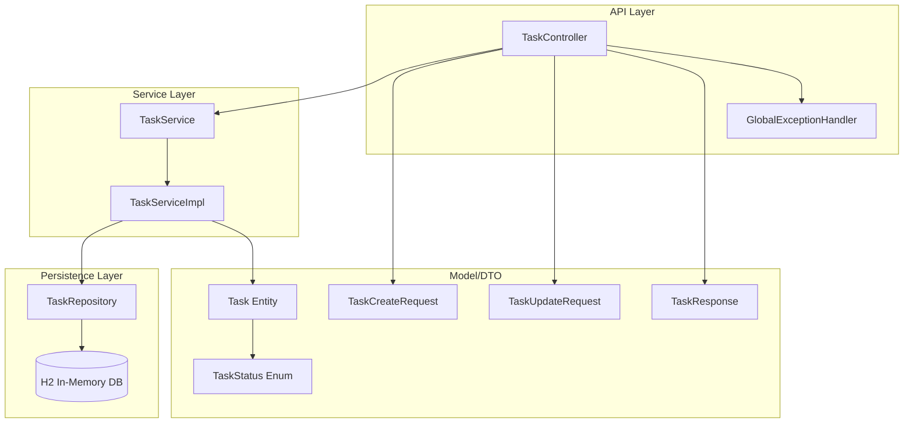
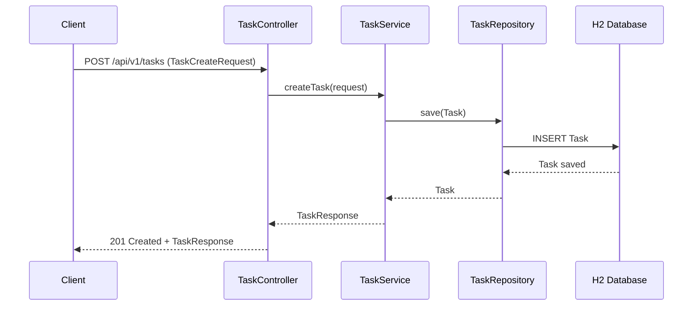

## 🏗️ Architecture Proposal

### Overview
The solution is a Spring Boot 3.2, Java 21 REST API with a layered architecture: Controller → Service → Repository → H2 (in-memory). It supports full CRUD for Task entities, validation via Bean Validation, and standardized error handling via `@ControllerAdvice`. OpenAPI/Swagger is provided using springdoc. UUIDs are used as identifiers; timestamps are handled via JPA auditing or entity callbacks. The design directly maps to acceptance criteria for endpoints, validation, HTTP status codes, and H2 persistence behavior.

### Component Diagram


### Sequence Diagram


### API Contracts

**Base Path:** `/api/v1/tasks`

#### POST `/api/v1/tasks`
- **Request Body (TaskCreateRequest)**  
```json
{
  "title": "string (required, non-empty)",
  "description": "string (optional)",
  "status": "TODO|IN_PROGRESS|DONE (optional)",
  "dueDate": "YYYY-MM-DD (optional)"
}
```
- **Responses**
  - `201 Created`: TaskResponse
  - `400 Bad Request`: validation error (missing title, invalid status/date)

#### GET `/api/v1/tasks/{id}`
- **Path Param**: `id` (UUID)
- **Responses**
  - `200 OK`: TaskResponse
  - `404 Not Found`: if not found
  - `400 Bad Request`: invalid UUID format (framework default)

#### GET `/api/v1/tasks`
- **Responses**
  - `200 OK`: List<TaskResponse>

#### PUT `/api/v1/tasks/{id}`
- **Request Body (TaskUpdateRequest - full replace)**
```json
{
  "title": "string (required, non-empty)",
  "description": "string (optional)",
  "status": "TODO|IN_PROGRESS|DONE (optional)",
  "dueDate": "YYYY-MM-DD (optional)"
}
```
- **Responses**
  - `200 OK`: TaskResponse
  - `400 Bad Request`: validation error
  - `404 Not Found`: if not found

#### PATCH `/api/v1/tasks/{id}`
- **Request Body (TaskUpdateRequest - partial)**
```json
{
  "title": "string (optional, non-empty if present)",
  "description": "string (optional)",
  "status": "TODO|IN_PROGRESS|DONE (optional)",
  "dueDate": "YYYY-MM-DD (optional)"
}
```
- **Responses**
  - `200 OK`: TaskResponse
  - `400 Bad Request`: validation error
  - `404 Not Found`: if not found

#### DELETE `/api/v1/tasks/{id}`
- **Responses**
  - `204 No Content`
  - `404 Not Found`: if not found

**TaskResponse**
```json
{
  "id": "UUID",
  "title": "string",
  "description": "string|null",
  "status": "TODO|IN_PROGRESS|DONE|null",
  "dueDate": "YYYY-MM-DD|null",
  "createdAt": "ISO-8601 instant",
  "updatedAt": "ISO-8601 instant"
}
```

**Validation Error Response (example)**
```json
{
  "timestamp": "2026-01-14T00:00:00Z",
  "status": 400,
  "errors": [
    { "field": "title", "message": "must not be blank" }
  ]
}
```

### Proposed File Structure
```
src/main/java/com/example/taskapi
├── TaskApiApplication.java
├── controller
│   └── TaskController.java
├── service
│   ├── TaskService.java
│   └── TaskServiceImpl.java
├── repository
│   └── TaskRepository.java
├── model
│   ├── Task.java
│   └── TaskStatus.java
├── dto
│   ├── TaskCreateRequest.java
│   ├── TaskUpdateRequest.java
│   └── TaskResponse.java
├── config
│   ├── OpenApiConfig.java
│   └── JpaAuditingConfig.java
└── exception
    ├── GlobalExceptionHandler.java
    └── ResourceNotFoundException.java

src/test/java/com/example/taskapi
├── controller
│   └── TaskControllerTest.java
├── service
│   └── TaskServiceTest.java
└── integration
    └── TaskIntegrationTest.java

src/main/resources
├── application.yml
└── application-test.yml
```

### Design Decisions
- **Layered Architecture**: Ensures separation of concerns, easy testing, and aligns with Spring Boot best practices.
- **DTOs as Records**: Uses Java 21 records for immutable request/response payloads.
- **Validation**: Bean Validation annotations on DTOs; `@ControllerAdvice` for standardized error responses.
- **UUID IDs**: Generated at persistence layer (e.g., `@GeneratedValue` with UUID).
- **Timestamps**: JPA auditing or `@PrePersist/@PreUpdate` to ensure createdAt/updatedAt per acceptance criteria.
- **H2 In-Memory**: Ensures non-persistence across restarts as required.
- **springdoc-openapi**: Provides Swagger UI at `/swagger-ui.html` and `/swagger-ui/index.html`.

---
*Reply with APPROVED to proceed, or FEEDBACK: [your suggestions] for revisions.*